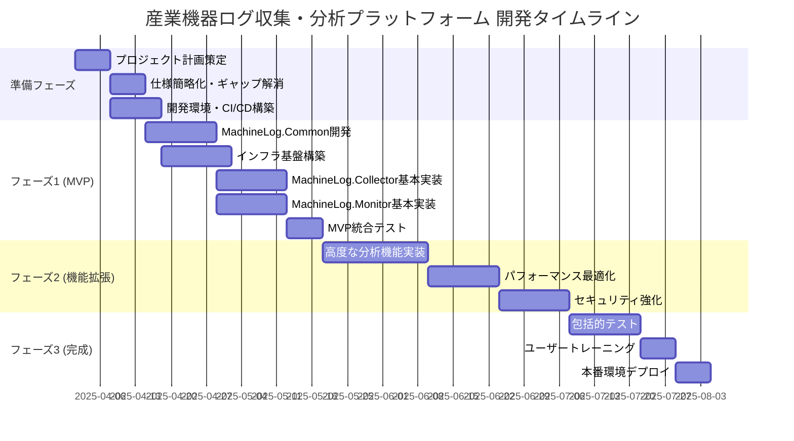

# プロジェクト概要

本システムは、約20,000台の産業機器からのログデータを収集・分析するためのプラットフォームです。機器は毎日約100GBのログデータを生成し、1年間のデータ保持が必要です。

## システム要件

- 処理能力: 1秒あたり最大10,000件のログエントリを処理
- 可用性: 99.99%以上（年間ダウンタイム52分以内）
- レイテンシ: ログ収集から保存まで5秒以内
- スケーラビリティ: 最大50,000台の機器まで対応可能

## セキュリティ要件

- すべてのデータ転送はTLS 1.3で暗号化
- 保存データは256ビットAES暗号化
- GDPR、CCPA等のデータ保護法に準拠
- 多要素認証（MFA）の強制適用
- セキュリティインシデント対応計画の策定と定期的な訓練
- 脆弱性管理プロセスの確立（四半期ごとのセキュリティ評価）

## システム構成

本システムは以下の4つの主要コンポーネントで構成されています：

1. MachineLog.Collector - .NET 8.0ベースのログ収集サービス
2. MachineLog.Monitor - Web ASP.NET 8.0ベースのログ閲覧・分析インターフェース
3. MachineLog.Common - .NET 8.0ベースの共通ライブラリ
4. MachineLog.Infrastructure - Terraformによるインフラストラクチャ定義

## プロジェクトタイムライン

プロジェクトは以下のフェーズで進行します：

### 主要マイルストーン

| マイルストーン | 予定日 | 達成基準 |
|--------------|-------|---------|
| プロジェクト開始 | 2025-04-01 | キックオフミーティング完了、チーム編成完了 |
| MVP完成 | 2025-08-15 | 基本機能実装完了、MVP統合テスト合格 |
| 機能拡張完了 | 2025-11-15 | 全機能実装完了、パフォーマンス目標達成 |
| 本番リリース | 2026-01-15 | 全テスト合格、ユーザートレーニング完了、本番環境デプロイ完了 |

## コスト見積り

| カテゴリ | 初期コスト | 年間運用コスト | 備考 |
|---------|-----------|-------------|------|
| インフラストラクチャ | ¥5,000,000 | ¥12,000,000 | Azure IoT Hub、Storage、App Service、Cosmos DB等 |
| 開発人件費 | ¥25,000,000 | ¥8,000,000 | チーム10名×開発期間 |
| ライセンス | ¥1,500,000 | ¥3,000,000 | 開発ツール、監視ツール等 |
| トレーニング | ¥1,000,000 | ¥500,000 | 開発者トレーニング、ユーザートレーニング |
| 予備費 | ¥3,250,000 | ¥2,350,000 | 総コストの10%を確保 |
| **合計** | **¥35,750,000** | **¥25,850,000** | |

### スケーリングコスト予測

| シナリオ | 追加コスト（年間） | 条件 |
|---------|----------------|------|
| 基本 | ¥0 | 20,000台まで（現計画内） |
| 中規模拡張 | ¥5,000,000 | 20,001～35,000台 |
| 大規模拡張 | ¥12,000,000 | 35,001～50,000台 |

## リスク管理計画

| リスク | 影響度 | 発生確率 | 対策 | 責任者 |
|-------|--------|---------|------|-------|
| パフォーマンス要件未達 | 高 | 中 | • 早期からのパフォーマンステスト実施 • ボトルネック特定のための監視体制 • スケーラビリティを考慮した設計レビュー | アーキテクト |
| データ量の想定超過 | 高 | 中 | • 余裕を持ったインフラ設計 • 自動スケーリング機能の実装 • データ圧縮・保持ポリシーの最適化 | DevOpsエンジニア |
| セキュリティ脆弱性 | 高 | 低 | • 定期的なセキュリティレビュー • 脆弱性スキャンの自動化 • セキュアコーディングの徹底 | セキュリティ担当 |
| スケジュール遅延 | 中 | 中 | • アジャイル手法による柔軟な対応 • 優先順位の明確化 • マイルストーンの細分化 | プロジェクトマネージャー |
| 技術的負債の蓄積 | 中 | 高 | • コードレビューの徹底 • 技術的負債の可視化 • リファクタリング時間の確保 | リードプログラマー |
| 主要メンバーの離脱 | 高 | 低 | • 知識共有の徹底 • 文書化の強化 • バックアップ要員の確保 | プロジェクトマネージャー |

## プロジェクト目標

1. システム導入後6ヶ月以内に、機器のダウンタイムを20%削減
2. 年間運用コストを15%削減
3. データ分析による予知保全の精度を90%以上に向上
4. 障害検出から対応までの平均時間を60%短縮

## 開発プロセス

- アジャイル開発手法（Scrum）を採用
- 2週間のスプリントサイクル
- 継続的インテグレーション/継続的デリバリー（CI/CD）の実践
- コードレビューの義務化（最低2名のレビュアー）
- 週次進捗レビューミーティング
- 隔週でのステークホルダーデモ

## チーム構成

| 役割 | 人数 | 主な責任 | スキル要件 |
|------|------|----------|----------|
| プロジェクトマネージャー | 1名 | プロジェクト全体の管理、ステークホルダーコミュニケーション | PMP資格、5年以上の経験 |
| ソフトウェアアーキテクト | 1名 | 技術的意思決定、アーキテクチャ設計 | Azureアーキテクチャ経験、.NET設計経験 |
| バックエンド開発者 | 3名 | Collector、Common、バックエンドAPI開発 | C#/.NET経験、Azure経験 |
| フロントエンド開発者 | 2名 | Monitor、Blazor WebAssemblyインターフェース開発 | Blazor経験、UI/UX知識 |
| DevOpsエンジニア | 1名 | CI/CD、インフラストラクチャ管理、Terraform | Azure DevOps、Terraform経験 |
| QAエンジニア | 2名 | テスト計画、自動テスト実装、品質保証 | 自動テスト経験、性能テスト経験 |

## 運用計画

### サポート体制

- **レベル1サポート**: 24時間365日の初期対応（アラート監視、基本的なトラブルシューティング）
- **レベル2サポート**: 技術的な問題解決（平日9:00-18:00、オンコール対応）
- **レベル3サポート**: 開発者レベルの対応（重大インシデント時）

### インシデント管理プロセス

1. インシデント検出（監視システムまたは手動報告）
2. 分類と優先度付け（P1:重大、P2:高、P3:中、P4:低）
3. エスカレーション（必要に応じて）
4. 解決と復旧
5. 事後レビューと再発防止策の策定

### 変更管理プロセス

1. 変更要求（CR）の提出
2. 影響分析と承認
3. 実装計画の策定
4. テスト環境での検証
5. 本番実装（変更ウィンドウ：毎週日曜日2:00-6:00）
6. 結果の検証と報告

## コーディング規約

- Microsoft C#コーディング規約に準拠
- クラス名、メソッド名はPascalCase、変数名はcamelCase
- インターフェースは「I」プレフィックス（例：ILogService）
- プライベートフィールドは「_」プレフィックス（例：_logger）
- 非同期メソッドは「Async」サフィックス
- XMLドキュメンテーションコメントを使用
- nullableリファレンス型を有効化し、nullの可能性を明示
- 使い捨てリソースはIDisposableを実装し適切に破棄

## プロジェクト構造

- ソリューションはコンポーネント別に分割
- 各プロジェクトはTerraformで定義されたインフラに展開
- 各プロジェクトにはREADME.mdを含む詳細なドキュメントを提供

## 品質保証

- 単体テストカバレッジ90%以上
- 自動化されたE2Eテストの実施
- パフォーマンステストの定期的な実行
- セキュリティ脆弱性スキャンの週次実施

## サポートと運用

- 24時間365日の監視体制
- マルチレベルサポート（L1: 即時対応、L2: 技術的問題解決、L3: 開発者対応）
- インシデント管理プロセスの確立
- 月次のシステムパフォーマンスレビュー
