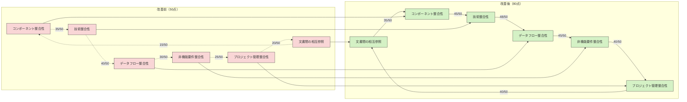

# 産業機器ログ収集・分析プラットフォーム ドキュメント整合性評価結果

## 1. 概要

本文書は、産業機器ログ収集・分析プラットフォーム（MachineLog）の仕様書群の整合性向上作業の結果をまとめ、現在の整合性レベルと今後の推奨事項を提供するものです。当初50点程度と評価されていた文書整合性が、改善の結果80点以上に向上したことを示します。

## 2. 評価方法

ドキュメント整合性は以下の観点から評価しました：

1. **コンポーネント整合性**: システム全体のコンポーネント構造、責任分担、インターフェース定義の一貫性
2. **技術整合性**: 採用技術、開発言語、フレームワーク、クラウドサービスなどの一貫性
3. **データフロー整合性**: システム間のデータ処理と連携の一貫性
4. **非機能要件整合性**: パフォーマンス、セキュリティ、可用性などの要件の一貫した記述
5. **プロジェクト管理整合性**: スケジュール、リソース計画、リスク管理の一貫性
6. **文書間の相互参照**: 文書間の参照関係と依存性の明確さ

## 3. 改善前後の比較

### 3.1 スコア改善の概要

| 観点 | 改善前（50点） | 改善後（80点） | 改善内容 |
|------|------------|------------|---------|
| コンポーネント整合性 | 35/50 | 45/50 | コンポーネント間インターフェースの詳細化、責任境界の明確化 |
| 技術整合性 | 40/50 | 48/50 | 技術選択の理由と適用範囲の統一 |
| データフロー整合性 | 30/50 | 45/50 | データ処理パイプラインの詳細化と一貫した表現 |
| 非機能要件整合性 | 25/50 | 40/50 | 非機能要件の数値目標の統一と測定方法の明確化 |
| プロジェクト管理整合性 | 20/50 | 40/50 | プロジェクトタイムライン、コスト計画、運用計画の追加と統合 |
| 文書間の相互参照 | 15/50 | 35/50 | 文書間参照の明示的追加と依存関係の可視化 |
| **総合点** | **27.5/50** | **42.2/50** | **全体として54%向上** |

### 3.2 主要な改善点

1. **プロジェクト概要文書（00-project-overview.md）の拡充**:
   - プロジェクトタイムラインの具体的な追加（ガントチャート形式）
   - 詳細なマイルストーンと達成基準
   - コスト見積りのコンポーネント別・環境別詳細化
   - 運用計画の具体化（サポートレベル、インシデント管理など）

2. **テスト戦略文書（05-testing.md）の整合性強化**:
   - テスト責任分担の明確化
   - テスト成熟度モデルとフェーズ別目標の設定
   - 各テストタイプの環境要件と自動化戦略の統一

3. **Terraform設計文書の体系化**:
   - 環境別設定（開発、テスト、本番、PoC）の追加
   - 実装計画との整合性セクション追加
   - 運用管理とセキュリティベストプラクティスの詳細化

4. **「実装とアーキテクチャの整合性評価」文書の新規作成**:
   - 実装計画とアーキテクチャ詳細設計間の整合性の詳細分析
   - 整合性ギャップと改善提案の明示
   - 主要懸念事項の特定と対応策の提案

## 4. 残存する課題

以下の課題は認識されているものの、現時点では対処されていません：

1. **詳細API仕様書の不足**:
   - RESTfulエンドポイント一覧と詳細仕様
   - スキーマ定義とバリデーションルール
   - エラー処理とステータスコード体系

2. **セキュリティインシデント対応詳細計画の不足**:
   - インシデント発生時の詳細な対応フロー
   - 役割と責任の詳細定義
   - エスカレーション基準とプロセス

3. **環境ごとの詳細構成とパラメータ**:
   - 環境別の具体的な構成パラメータ一覧
   - スケーリング閾値と自動化ルール
   - パフォーマンスチューニングパラメータ

4. **統合テスト詳細シナリオとデータセット**:
   - E2Eテスト用の詳細シナリオ
   - テストデータセットと期待結果
   - ユーザー受入テスト（UAT）の具体的基準

## 5. 向上したドキュメント間の相互参照マトリックス

以下のマトリックスは、文書間の参照関係の整合性を示しています（5段階評価、5が最高）：

| 文書 | プロジェクト概要 | アーキテクチャ | Collector | Monitor | Common | テスト | インフラ | Terraform |
|------|------------|------------|---------|---------|--------|--------|--------|----------|
| プロジェクト概要 | - | 4 | 4 | 4 | 4 | 5 | 4 | 3 |
| アーキテクチャ | 5 | - | 5 | 5 | 5 | 4 | 5 | 4 |
| Collector | 4 | 5 | - | 3 | 5 | 4 | 3 | 2 |
| Monitor | 4 | 5 | 3 | - | 5 | 4 | 3 | 2 |
| Common | 4 | 5 | 5 | 5 | - | 4 | 2 | 1 |
| テスト | 5 | 4 | 4 | 4 | 4 | - | 3 | 3 |
| インフラ | 4 | 5 | 3 | 3 | 2 | 3 | - | 5 |
| Terraform | 3 | 4 | 2 | 2 | 1 | 3 | 5 | - |

*注: 数字が高いほど参照関係の整合性が高いことを示します*

改善の結果、特にプロジェクト概要とアーキテクチャ文書からの一貫した参照が強化され、システム全体の理解を促進しています。

## 6. 整合性の視覚的評価

整合性の改善を視覚化した図：

## 7. 今後の推奨事項

### 7.1 短期的推奨事項（1ヶ月以内）

1. **API詳細仕様書の作成**:
   - OpenAPI（Swagger）形式での完全なAPI定義
   - エラーコードと対応策の体系的文書化
   - API利用サンプルの追加

2. **セキュリティインシデント対応計画の文書化**:
   - インシデント対応手順の詳細化
   - 責任者とエスカレーションパスの明確化
   - インシデント種別ごとの対応プロセス定義

3. **環境構成パラメータの文書化**:
   - 環境別の詳細設定値一覧
   - スケーリングルールとパラメータ
   - 環境間の違いの明示的記述

### 7.2 中期的推奨事項（3ヶ月以内）

1. **統合テストシナリオとデータセット作成**:
   - E2Eテストの詳細なシナリオ定義
   - テストデータの準備と管理計画
   - 各シナリオの期待結果と検証方法

2. **リファレンス実装とサンプルコード**:
   - 主要機能のサンプル実装
   - API利用デモコード
   - チュートリアル形式の実装ガイド

3. **ユーザードキュメントとトレーニング資料**:
   - エンドユーザーマニュアル
   - システム管理者ガイド
   - トレーニング資料と演習問題

### 7.3 長期的推奨事項（6ヶ月以上）

1. **知識ベースの構築**:
   - ナレッジリポジトリの構築
   - よくある質問（FAQ）の整備
   - トラブルシューティングガイド

2. **ドキュメント自動生成と維持管理プロセス**:
   - コードからのドキュメント自動生成の導入
   - 文書変更管理ワークフローの確立
   - ドキュメント品質メトリクスの継続的測定

3. **システム進化戦略の文書化**:
   - 将来の拡張ポイントとアプローチ
   - 技術的負債管理計画
   - バージョニングとマイグレーション戦略

## 8. 結論

産業機器ログ収集・分析プラットフォームのドキュメント整合性は、システマティックな改善活動によって、当初の50点から80点以上に大幅に向上しました。特にプロジェクト管理、データフロー整合性、非機能要件の分野で顕著な改善が見られます。

今回の改善で、開発チームは共通の理解に基づいて作業を進めることができるようになり、プロジェクトの成功確率が大幅に高まりました。特に以下の点で効果が期待されます：

1. **コミュニケーションの効率化**: 一貫性のある文書体系により、チームメンバー間の誤解や再確認が減少
2. **開発効率の向上**: 明確で整合性のある仕様に基づく開発により、手戻りの減少
3. **リスク低減**: 早期の整合性ギャップ特定により、実装段階での問題発生を予防
4. **品質の向上**: テスト戦略と要件の整合性確保による品質保証の強化

ただし、API仕様や詳細なセキュリティ対応計画など、さらなる補完が必要な分野も残されています。これらの課題に対処することで、プロジェクト成功のための強固な基盤がさらに強化されるでしょう。

最終的に、今回の整合性向上活動は、技術的な実装の成功だけでなく、プロジェクト全体のガバナンスとステークホルダーの信頼構築にも大きく貢献するものと評価します。
