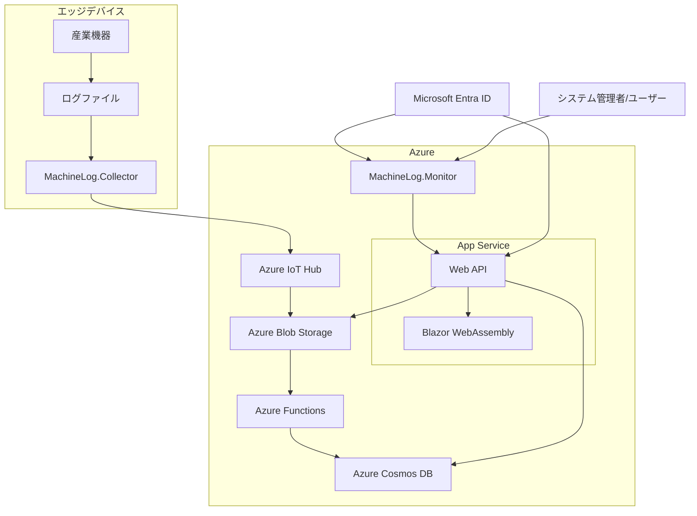
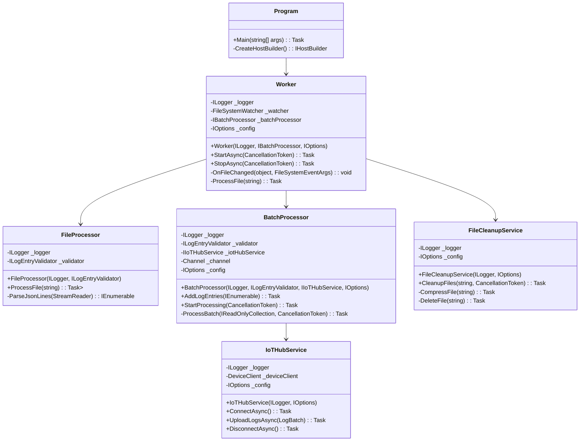
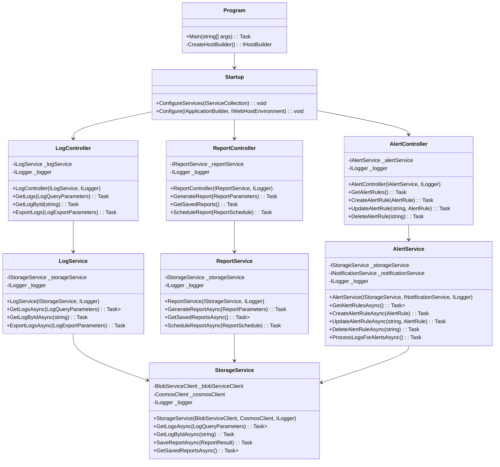
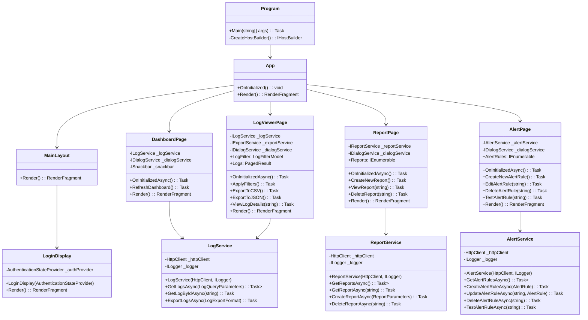

# 産業機器ログ収集・分析プラットフォーム アーキテクチャ詳細設計

## 1. 概要

本文書は、産業機器ログ収集・分析プラットフォーム（MachineLog）の詳細なアーキテクチャ設計を記述しています。実装段階で開発チームが参照するための技術ガイドラインとなります。

## 2. システム全体構造

以下の図は、システム全体のアーキテクチャ概要を示しています：



## 3. コンポーネント詳細設計

### 3.1 MachineLog.Collector

#### 3.1.1 内部構造



#### 3.1.2 設定クラス構造

```
CollectorConfig
  ├── MonitoringPaths: List<string>           # 監視対象ディレクトリのパス
  ├── FileFilter: string                       # 監視対象ファイル拡張子 (.log, .json, .jsonl)
  ├── StabilizationPeriod: TimeSpan           # ファイル安定待機時間（デフォルト5秒）
  ├── MaxConcurrency: int                     # 最大並行処理数
  └── RetentionPolicy: RetentionPolicy        # ファイル保持ポリシー

BatchConfig
  ├── MaxBatchSize: int                        # 最大バッチサイズ（バイト）
  ├── MaxBatchItems: int                       # 最大バッチアイテム数
  ├── ProcessingInterval: TimeSpan            # バッチ処理間隔
  └── RetryPolicy: RetryPolicy                # リトライポリシー

IoTHubConfig
  ├── ConnectionString: string                 # IoT Hub接続文字列
  ├── DeviceId: string                         # デバイスID
  ├── SasToken: string                         # SASトークン
  └── UploadFolderPath: string                # アップロード先フォルダパス
```

#### 3.1.3 主要インターフェース

```csharp
public interface ILogEntryValidator
{
    ValidationResult Validate(LogEntry entry);
    bool IsValid(LogEntry entry);
}

public interface IBatchProcessor
{
    Task AddLogEntries(IEnumerable<LogEntry> entries);
    Task StartProcessing(CancellationToken cancellationToken);
}

public interface IIoTHubService
{
    Task ConnectAsync();
    Task UploadLogsAsync(LogBatch batch);
    Task DisconnectAsync();
}

public interface IFileProcessor
{
    Task<IEnumerable<LogEntry>> ProcessFile(string filePath);
}
```

### 3.2 MachineLog.Monitor

#### 3.2.1 内部構造



#### 3.2.2 Blazor WebAssembly 構造



### 3.3 MachineLog.Common

#### 3.3.1 クラス構造

```mermaid
classDiagram
    class LogEntry {
        +string MachineId
        +DateTimeOffset TimeGenerated
        +LogSeverity Severity
        +int EventId
        +string Message
        +Guid OperationId
        +Dictionary<string, string> Tags
        +Validate() : ValidationResult
        +Clone() : LogEntry
    }
    
    class LogBatch {
        +Guid BatchId
        +DateTime CreatedAt
        +IReadOnlyCollection<LogEntry> Entries
        +int Size
        +string Source
        +BatchProcessingStats ProcessingStats
        +Validate() : ValidationResult
    }
    
    class BatchProcessingStats {
        +int ProcessedCount
        +int FailedCount
        +int RetryCount
        +TimeSpan ProcessingTime
        +DateTime StartedAt
        +DateTime? CompletedAt
    }
    
    class LogEntryValidator {
        +ValidationResult Validate(LogEntry entry)
        +bool IsValid(LogEntry entry)
        -ValidateMachineId(string) : ValidationResult
        -ValidateTimeGenerated(DateTimeOffset) : ValidationResult
        -ValidateSeverity(LogSeverity) : ValidationResult
        -ValidateEventId(int) : ValidationResult
        -ValidateMessage(string) : ValidationResult
        -ValidateOperationId(Guid) : ValidationResult
        -ValidateTags(Dictionary<string, string>) : ValidationResult
    }
    
    class LogBatchValidator {
        +ValidationResult Validate(LogBatch batch)
        +bool IsValid(LogBatch batch)
        -ValidateBatchId(Guid) : ValidationResult
        -ValidateCreatedAt(DateTime) : ValidationResult
        -ValidateEntries(IReadOnlyCollection<LogEntry>) : ValidationResult
        -ValidateSize(int) : ValidationResult
    }
    
    class StringUtility {
        +string TruncateIfNeeded(string, int)
        +string ToSafeJson(string)
        +bool IsValidJson(string)
        +string SanitizeString(string)
        +int GetByteSize(string)
    }
    
    class DateTimeUtility {
        +string ToIso8601String(DateTime)
        +DateTime FromIso8601String(string)
        +bool IsValidIso8601(string)
        +long GetUnixTimestamp(DateTime)
        +DateTime FromUnixTimestamp(long)
    }
    
    class CollectionUtility {
        +IEnumerable<IEnumerable<T>> Batch<T>(IEnumerable<T>, int)
        +bool SafeAny<T>(IEnumerable<T>)
        +IEnumerable<IEnumerable<T>> ChunkBySize<T>(IEnumerable<T>, int)
        +IReadOnlyCollection<T> ToReadOnlyCollection<T>(IEnumerable<T>)
        +IEnumerable<T> Shuffle<T>(IEnumerable<T>)
    }
    
    class JsonUtility {
        +string Serialize<T>(T)
        +T Deserialize<T>(string)
        +bool IsValidJson(string)
        +JObject MergeJsonObjects(JObject, JObject)
        +IEnumerable<T> ParseJsonLines<T>(string)
    }
    
    class RetryUtility {
        +T ExecuteWithRetry<T>(Func<T>, RetryPolicy)
        +Task<T> ExecuteWithRetryAsync<T>(Func<Task<T>>, RetryPolicy)
        +RetryPolicy CreateExponentialBackoff(int, TimeSpan, TimeSpan)
        +RetryPolicy CreateConstantBackoff(int, TimeSpan)
        +bool IsTransientException(Exception)
    }
    
    class SizeCalculationUtility {
        +int CalculateSize<T>(T)
        +int CalculateBatchSize(LogBatch)
        +int EstimateJsonSize<T>(T)
        +bool IsWithinSizeLimit<T>(T, int)
    }
    
    LogEntry --> LogSeverity
    LogBatch --> LogEntry
    LogBatch --> BatchProcessingStats
    LogEntryValidator ..> LogEntry
    LogBatchValidator ..> LogBatch
```



#### 3.3.2 列挙型定義

```csharp
public enum LogSeverity
{
    Debug = 0,
    Info = 1,
    Warning = 2,
    Error = 3,
    Critical = 4
}

public enum LogExportFormat
{
    Csv,
    Json,
    Excel
}

public enum AlertOperator
{
    Equals,
    NotEquals,
    Contains,
    NotContains,
    GreaterThan,
    LessThan,
    StartsWith,
    EndsWith
}

public enum AlertSeverity
{
    Low,
    Medium,
    High,
    Critical
}

public enum NotificationChannel
{
    Email,
    SMS,
    Webhook,
    InApp
}

public enum ReportType
{
    Daily,
    Weekly,
    Monthly,
    Custom
}
```

## 4. データモデルと契約

### 4.1 LogEntry モデル

```json
{
  "machineId": "machine-001",
  "timeGenerated": "2025-03-21T15:30:45.123Z",
  "severity": "Error",
  "eventId": 504,
  "message": "温度センサー異常: 95.5°C (上限閾値 85°C)",
  "operationId": "550e8400-e29b-41d4-a716-446655440000",
  "tags": {
    "sensorId": "temp-sensor-42",
    "location": "第3製造ライン",
    "component": "熱交換器",
    "alertType": "temperature"
  }
}
```

### 4.2 ログ検索パラメータモデル

```csharp
public class LogQueryParameters
{
    // 必須パラメータ
    public DateTime StartTime { get; set; }
    public DateTime EndTime { get; set; }
    
    // オプションパラメータ
    public List<string> MachineIds { get; set; }
    public List<LogSeverity> Severities { get; set; }
    public string MessageFilter { get; set; }
    public Dictionary<string, string> Tags { get; set; }
    public int? EventId { get; set; }
    public Guid? OperationId { get; set; }
    
    // ページング
    public int PageSize { get; set; } = 100;
    public int PageNumber { get; set; } = 1;
    
    // ソート
    public string SortBy { get; set; } = "timeGenerated";
    public bool SortDescending { get; set; } = true;
}
```

### 4.3 レポートパラメータモデル

```csharp
public class ReportParameters
{
    // 必須パラメータ
    public string ReportName { get; set; }
    public ReportType ReportType { get; set; }
    public DateTime StartTime { get; set; }
    public DateTime EndTime { get; set; }
    
    // フィルター（LogQueryParametersと同様）
    public List<string> MachineIds { get; set; }
    public List<LogSeverity> Severities { get; set; }
    public string MessageFilter { get; set; }
    public Dictionary<string, string> Tags { get; set; }
    
    // レポート設定
    public bool IncludeSummaryStats { get; set; } = true;
    public bool IncludeCharts { get; set; } = true;
    public bool IncludeRawData { get; set; } = false;
    public LogExportFormat ExportFormat { get; set; } = LogExportFormat.Excel;
    
    // スケジュール（オプション）
    public bool IsScheduled { get; set; } = false;
    public ReportSchedule Schedule { get; set; }
}
```

### 4.4 アラートルールモデル

```csharp
public class AlertRule
{
    // 必須パラメータ
    public string RuleId { get; set; }
    public string RuleName { get; set; }
    public string Condition { get; set; } // JSONで実際の条件を保存
    public AlertSeverity Severity { get; set; }
    
    // 通知設定
    public List<NotificationTarget> NotificationTargets { get; set; }
    public bool IsEnabled { get; set; } = true;
    
    // 条件評価のためのメソッド
    public bool EvaluateCondition(LogEntry logEntry);
}

public class NotificationTarget
{
    public NotificationChannel Channel { get; set; }
    public string Target { get; set; } // メールアドレス、URL、電話番号など
    public Dictionary<string, string> AdditionalParams { get; set; }
}
```

## 5. API エンドポイント設計

### 5.1 ログAPI

| エンドポイント | メソッド | 説明 | パラメータ |
|---------------|---------|------|-----------|
| `/api/logs` | GET | ログの取得 | `LogQueryParameters` |
| `/api/logs/{id}` | GET | 特定ログの取得 | `id`: ログID |
| `/api/logs/export` | POST | ログのエクスポート | `LogExportParameters` |
| `/api/logs/dashboard` | GET | ダッシュボード用サマリーデータ | `startTime`, `endTime`, `machineIds` |

### 5.2 レポートAPI

| エンドポイント | メソッド | 説明 | パラメータ |
|---------------|---------|------|-----------|
| `/api/reports` | GET | 保存済みレポートの取得 | - |
| `/api/reports` | POST | レポート生成 | `ReportParameters` |
| `/api/reports/{id}` | GET | 特定レポートの取得 | `id`: レポートID |
| `/api/reports/{id}` | DELETE | レポートの削除 | `id`: レポートID |
| `/api/reports/schedule` | POST | レポートスケジュール設定 | `ReportSchedule` |

### 5.3 アラートAPI

| エンドポイント | メソッド | 説明 | パラメータ |
|---------------|---------|------|-----------|
| `/api/alerts/rules` | GET | アラートルール一覧取得 | - |
| `/api/alerts/rules` | POST | アラートルール作成 | `AlertRule` |
| `/api/alerts/rules/{id}` | GET | 特定アラートルール取得 | `id`: ルールID |
| `/api/alerts/rules/{id}` | PUT | アラートルール更新 | `id`: ルールID, `AlertRule` |
| `/api/alerts/rules/{id}` | DELETE | アラートルール削除 | `id`: ルールID |
| `/api/alerts/history` | GET | アラート履歴取得 | `startTime`, `endTime`, `severity` |

## 6. クラウドリソース詳細設計

### 6.1 Azure IoT Hub

- **SKU**: S1 (Standard)
- **設定**:
  - メッセージ/日: 最大400万メッセージ（4つのパーティション）
  - ファイルアップロード設定:
    - Blob Storageコンテナ: `log-files`
    - 保存期間: 7日間
    - 通知設定: 有効
  - ルーティング: 
    - ストレージへのルート（全メッセージ）
    - アラート条件に一致するメッセージのイベントハブへのルート

### 6.2 Azure Blob Storage

- **アカウントタイプ**: StorageV2（汎用v2）
- **冗長性**: LRS（ローカル冗長ストレージ）
- **階層型名前空間**: 有効
- **ライフサイクル管理**: シンプル化（PoCでは長期アクセス層の管理を省略）

- **コンテナ構造**:
  ```
  log-files/
  ├── {yyyy}/{MM}/{dd}/          # 日付階層
  │   └── {machineId}/           # 機器ID
  │       └── {timestamp}_{uuid}.jsonl  # ログファイル
  │
  reports/
  ├── scheduled/                 # スケジュール済みレポート
  │   └── {reportType}/{reportName}/{timestamp}.{format}
  │
  ├── adhoc/                     # アドホックレポート
  │   └── {userId}/{reportName}/{timestamp}.{format}
  │
  exports/
  └── {userId}/{timestamp}_{exportId}.{format}  # エクスポートファイル
  ```

- **ライフサイクル管理**:
  - ログファイル: 90日後にCool層、365日後にArchive層
  - レポート/エクスポート: 90日後に削除（設定可能）

### 6.3 Azure App Service

- **SKU**: B1（ベーシック）
- **インスタンス数**: 1（固定インスタンス）
- **OS**: Linux
- **構成**:
  - .NET 8.0ランタイム
  - 仮想ネットワーク統合: 不要（PoC環境では簡素化）

### 6.4 Azure Functions

- **ホスティングプラン**: Consumption（サーバーレス）
- **関数タイプ**:
  - LogProcessorFunction: Blob Storage新規ファイル監視（BlobTrigger）
  - AlertProcessorFunction: ログのアラート条件評価（TimerTrigger）
  - ReportGeneratorFunction: レポート生成（TimerTrigger, QueueTrigger）

### 6.5 Azure Cosmos DB

- **APIタイプ**: SQL API
- **容量モード**: サーバーレス
- **地理冗長**: なし（単一リージョン構成）
- **データベース/コンテナ**:
  ```
  machineLogDB/
  ├── logEntries            # ログエントリ（90日間）
  │   パーティションキー: machineId
  │
  ├── alertRules            # アラートルール
  │   パーティションキー: ruleId
  │
  ├── alertHistory          # アラート履歴
  │   パーティションキー: machineId
  │
  ├── reportDefinitions     # レポート定義
  │   パーティションキー: reportId
  │
  └── userPreferences       # ユーザー設定
      パーティションキー: userId
  ```

### 6.6 Azure App Service の直接アクセス

- **設定**:
  - SSL: App Service 管理証明書を使用
  - カスタムドメイン: 必要に応じてシンプルな設定
  - シングルリージョン構成: サンプルとしての簡潔さを優先

## 7. セキュリティ設計

### 7.1 認証と認可

- **認証方式**:
  - Web/API: Microsoft Entra ID（旧Azure AD）
  - IoT Hub: SASトークン、X.509証明書
  
- **認可モデル**:
  - ロールベースのアクセス制御（RBAC）
  - 定義済みロール:
    - 管理者（Admin）: すべての操作
    - オペレーター（Operator）: 閲覧、レポート生成、アラート設定
    - 閲覧者（Viewer）: 閲覧、レポート生成のみ
    - 機器マネージャー（Device Manager）: 機器管理のみ

- **アクセス制御実装**:
  ```csharp
  [Authorize(Roles = "Admin,Operator")]
  [HttpPost("api/alerts/rules")]
  public async Task<IActionResult> CreateAlertRule([FromBody] AlertRule rule)
  {
      // 実装
  }
  ```

### 7.2 データ保護

- **保存データの暗号化**:
  - Blob Storage: Azure Storage Service Encryption（AES-256）
  - Cosmos DB: 保存時の暗号化（AES-256）
  - Key Vault: 機密情報（接続文字列、アクセスキー）の安全な保管

- **転送中データの暗号化**:
  - すべての通信でTLS 1.3を使用
  - 証明書の自動更新設定

- **API通信におけるセキュリティヘッダー**:
  ```csharp
  app.Use(async (context, next) =>
  {
      context.Response.Headers.Add("X-Content-Type-Options", "nosniff");
      context.Response.Headers.Add("X-Frame-Options", "DENY");
      context.Response.Headers.Add("X-XSS-Protection", "1; mode=block");
      context.Response.Headers.Add("Content-Security-Policy", "default-src 'self'");
      context.Response.Headers.Add("Strict-Transport-Security", "max-age=31536000; includeSubDomains");
      await next();
  });
  ```

### 7.3 侵入検知と防止

- **WAF設定（Azure Front Door）**:
  - OWASP Top 10対策ルールセット
  - カスタムルール:
    - レート制限: 1分間に100リクエスト/IPアドレス
    - 地理的制限: 特定の国からのアクセスをブロック
    - 特定のユーザーエージェントをブロック

- **アプリケーションレベルの保護**:
  - 入力検証とサニタイズ処理
  - SQLインジェクション対策
  - XSS対策
  - CSRF対策（アンチフォージェリトークン）

### 7.4 監査とコンプライアンス

- **監査ログ設定**:
  - すべての認証イベントのログ記録
  - 管理操作のログ記録
  - データアクセスのログ記録

- **コンプライアンス対応**:
  - GDPR: 個人データの識別と管理
  - CCPA: 消費者プライバシー権対応
  - ISO 27001: 情報セキュリティ管理

## 8. スケーラビリティとパフォーマンス設計

### 8.1 水平スケーリング

- **Collectorサービス**:
  - 負荷分散: ラウンドロビン
  - スケールアウトの条件: CPUまたはメモリ使用率が閾値を超えた場合
  - スケールの単位: 1インスタンス

- **Webアプリケーション**:
  - App Serviceの自動スケーリング設定
  - スケールアウトの条件:
    - CPU使用率 > 70%
    - メモリ使用率 > 80%
    - リクエストキュー長 > 50

- **データベース**:
  - Cosmos DBの自動スケーリング
  - 最小RU/s: 400
  - 最大RU/s: 4000
  - スケーリングファクター: 使用率に基づく

### 8.2 パフォーマンス最適化

- **MachineLog.Collector**:
  - バッチ処理の最適化:
    - 動的バッチサイズ調整
    - メモリプール使用
    - 効率的なJSONパーシング
  
  ```csharp
  // 効率的なJSON処理の例
  using System.Text.Json;
  using System.IO;
  
  public async IAsyncEnumerable<LogEntry> ParseJsonLinesAsync(Stream stream)
  {
      using var reader = new StreamReader(stream);
      string line;
      var options = new JsonSerializerOptions
      {
          PropertyNameCaseInsensitive = true
      };
      
      while ((line = await reader.ReadLineAsync()) != null)
      {
          if (string.IsNullOrWhiteSpace(line))
              continue;
              
          try 
          {
              yield return JsonSerializer.Deserialize<LogEntry>(line, options);
          }
          catch (JsonException ex)
          {
              _logger.LogError(ex, "Invalid JSON line: {Line}", line);
          }
      }
  }
  ```

- **MachineLog.Monitor**:
  - Blazorパフォーマンス最適化:
    - 仮想化スクロール
    - 遅延ロード
    - メモリ管理
  
  ```csharp
  <Virtualize Context="log" Items="@Logs" OverscanCount="10">
      <LogEntryRow Log="@log" OnClick="@(() => ViewLogDetails(log.Id))" />
  </Virtualize>
  ```

- **データアクセス最適化**:
  - Cosmos DBインデックス最適化
  - キャッシュ層の追加（Redis Cache）
  - ホットパスのクエリチューニング

### 8.3 レイテンシ最適化

- **CDN活用**:
  - 静的コンテンツのエッジキャッシング
  - 地理的に最適なエンドポイント選択

- **バックエンドAPI最適化**:
  - 非同期処理の徹底
  - 効率的なクエリパターン
  - N+1問題の回避

- **リクエスト圧縮**:
  - gzip/br圧縮の適用
  - ブラウザキャッシュの最適化

## 9. 監視とテレメトリ

### 9.1 アプリケーション監視

- **Application Insights設定**:
  - サンプリングレート: 本番環境10%、その他環境100%
  - サーバー側テレメトリの収集
  - クライアント側テレメトリの収集
  - 依存関係追跡

- **カスタムメトリクス**:
  - LogCollector:
    - 処理されたファイル数
    - 処理されたログエントリ数
    - バッチ処理時間
    - エラー率
  
  - WebアプリケーションAPI:
    - リクエスト数/秒
    - 平均応答時間
    - エラーレート
    - アクティブユーザー数

### 9.2 インフラストラクチャ監視

- **Azure Monitor設定**:
  - リソース使用率監視
  - 自動スケーリングのメトリクス
  - ネットワーク監視

- **アラート設定**:
  - CPU使用率 > 85%
  - メモリ使用率 > 90%
  - ディスク容量 < 15%
  - エラー率 > 1%
  - 平均応答時間 > 2秒

### 9.3 ロギング戦略

- **ログレベル設定**:
  - 開発環境: Debug以上
  - テスト環境: Info以上
  - 本番環境: Warning以上（エラー調査時に一時的にInfo以上）

- **構造化ログ**:
  ```csharp
  _logger.LogInformation(
      "Log batch processed. BatchId: {BatchId}, Entries: {EntryCount}, ProcessingTime: {ProcessingTime}ms",
      batch.BatchId,
      batch.Entries.Count,
      processingTime.TotalMilliseconds);
  ```

- **Log Analytics Workspace**:
  - クエリ例:
  ```kusto
  AppEvents
  | where TimeGenerated > ago(24h)
  | where EventLevel == "Error"
  | summarize count() by bin(TimeGenerated, 15m), AppRoleInstance
  | render timechart
  ```

## 10. 障害対応とリカバリ戦略

### 10.1 障害シナリオと対応

| 障害タイプ | 影響 | 対応 |
|------------|------|------|
| App Service障害 | Webアプリ停止 | • 別リージョンへの自動フェイルオーバー<br>• Traffic Managerによる自動リダイレクト |
| IoT Hub障害 | ログ収集停止 | • Collectorのローカルバッファリング<br>• 代替IoT Hubへの接続切り替え |
| ストレージ障害 | データアクセス不可 | • 読み取り操作はセカンダリリージョンに自動フェイルオーバー<br>• 書き込み操作は復旧まで待機またはバッファリング |
| ネットワーク障害 | 接続不可 | • 指数バックオフリトライロジック<br>• 回復検出と再接続 |

### 10.2 データ復旧戦略

- **ログデータ**:
  - Blob Storageの地理冗長コピー（GRS）
  - ポイントインタイムリストアオプション

- **構成データ**:
  - Cosmos DBの継続的バックアップ
  - 最大30日間のポイントインタイムリストア

- **アプリケーション状態**:
  - ARM/Terraformテンプレートによるインフラ再構築
  - 構成のバージョン管理

### 10.3 障害検出と自動修復

- **ヘルスチェック**:
  ```csharp
  // ヘルスチェックの設定例
  services.AddHealthChecks()
      .AddCheck<IoTHubHealthCheck>("IoTHub")
      .AddCheck<StorageHealthCheck>("BlobStorage")
      .AddCheck<CosmosDbHealthCheck>("CosmosDB")
      .AddCheck<QueueHealthCheck>("MessageQueue");
  
  // ヘルスチェックエンドポイントの設定
  app.UseHealthChecks("/health", new HealthCheckOptions
  {
      ResponseWriter = UIResponseWriter.WriteHealthCheckUIResponse
  });
  ```

- **サーキットブレーカー**:
  ```csharp
  // Polly サーキットブレーカーの実装例
  var circuitBreakerPolicy = Policy
      .Handle<HttpRequestException>()
      .CircuitBreakerAsync(
          exceptionsAllowedBeforeBreaking: 3,
          durationOfBreak: TimeSpan.FromSeconds(30),
          onBreak: (ex, breakDelay) => 
          {
              _logger.LogWarning(ex, "Circuit breaker opened for {BreakDelay}ms", breakDelay.TotalMilliseconds);
          },
          onReset: () => 
          {
              _logger.LogInformation("Circuit breaker reset");
          });
  ```

## 11. 開発ガイドラインとベストプラクティス

### 11.1 コーディング規約

- **命名規則**:
  - クラス/メソッド: PascalCase
  - 変数: camelCase
  - プライベートフィールド: _camelCase
  - 定数: ALL_CAPS
  - インターフェース: IPascalCase

- **非同期プログラミング**:
  - async/awaitパターンの一貫した使用
  - ConfigureAwait(false)の適切な使用
  - CancellationTokenの伝播

- **エラー処理**:
  - 例外の適切な使用
  - 意味のある例外メッセージ
  - グローバル例外ハンドラの実装

### 11.2 ユニットテスト

- **テストのカバレッジ**:
  - パブリックメソッドは必ずテスト
  - 複雑なロジックは特に重点的にテスト
  - エッジケース、異常系のテスト

- **テスト構造**:
  ```csharp
  // テスト構造例
  [Fact]
  public async Task ProcessLogBatch_ValidBatch_ReturnsSuccess()
  {
      // Arrange
      var logBatch = CreateTestLogBatch(10);
      var validator = new LogBatchValidator();
      var iotHubServiceMock = new Mock<IIoTHubService>();
      iotHubServiceMock
          .Setup(x => x.UploadLogsAsync(It.IsAny<LogBatch>()))
          .ReturnsAsync(true);
      
      var processor = new BatchProcessor(
          Mock.Of<ILogger<BatchProcessor>>(),
          validator,
          iotHubServiceMock.Object,
          Options.Create(new BatchConfig()));
      
      // Act
      var result = await processor.ProcessBatchAsync(logBatch);
      
      // Assert
      Assert.True(result.IsSuccess);
      Assert.Equal(10, result.ProcessedCount);
      Assert.Equal(0, result.FailedCount);
      iotHubServiceMock.Verify(x => x.UploadLogsAsync(It.IsAny<LogBatch>()), Times.Once);
  }
  ```

### 11.3 パフォーマンスガイドライン

- **メモリ管理**:
  - 大きなオブジェクトのプール化
  - 不要なメモリ割り当ての最小化
  - ストリーム処理の活用

- **データベースアクセス**:
  - 効率的なクエリ
  - インデックスの適切な使用
  - N+1問題の回避

- **並行処理**:
  - スレッドセーフな実装
  - 並列処理の適切な使用
  - 適切なロック機構の使用

### 11.4 デプロイメントガイドライン

- **CI/CDパイプライン**:
  - すべてのプルリクエストでビルドと単体テスト実行
  - コードカバレッジ確認
  - 静的コード分析実行
  - 環境ごとの段階的デプロイ

- **環境固有の設定**:
  - 環境変数の使用
  - Key Vaultシークレット参照
  - 環境別の設定ファイル

## 12. 移行計画

既存システムからの移行やベーションアップの際には、以下の手順で行います：

### 12.1 段階的移行アプローチ

1. データ収集とログ保存の並行実行
2. 分析と可視化機能の移行
3. 完全切り替え

### 12.2 データ互換性の保証

- レガシーデータ形式の変換
- ヒストリカルデータのインポート
- データ検証プロセス

## まとめ

本アーキテクチャ詳細設計書は、産業機器ログ収集・分析プラットフォームのコンポーネント構造、データモデル、API設計、クラウドリソース構成、セキュリティ、パフォーマンス最適化について詳述しています。開発チームはこの設計書を基に、一貫性のある高品質な実装を進めることができます。