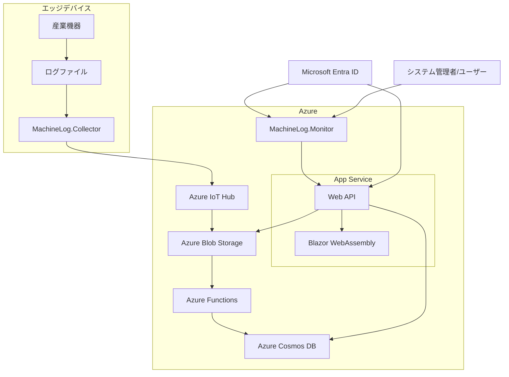

# システムアーキテクチャ

本システムは以下の主要コンポーネントで構成されています：

- **MachineLog.Collector**: .NET 8.0 Worker Serviceベースのログ収集サービス
  - 産業機器からログファイルを監視・収集
  - IoT HubのUploadModuleLogsを使用してBlobストレージにアップロード
  - 効率的なバッチ処理とリトライメカニズムを実装

- **MachineLog.Monitor**: ASP.NET 8.0 Webアプリケーション
  - Blazor WebAssemblyベースのSPA
  - Azure Storage APIを使用してログデータにアクセス
  - リアルタイム分析と可視化機能を提供

- **MachineLog.Common**: 共通ライブラリ
  - すべてのコンポーネントで共有されるモデルとユーティリティ
  - ログエントリの検証と処理のための標準化されたロジック

- **MachineLog.Infrastructure**: インフラストラクチャ定義
  - TerraformによるAzureリソースのプロビジョニング
  - 環境ごとの構成管理（開発、テスト、本番）

## アーキテクチャ概念図



## データフロー詳細

1. **ログ生成フェーズ**: 
   - 産業機器が内部センサーからデータを収集
   - JSON Lines形式のログファイルを生成（1行1JSONオブジェクト）
   - ローカルディスクに一時保存

2. **ログ収集フェーズ**: 
   - MachineLog.CollectorがFileSystemWatcherでファイル変更を検出
   - JSON Lines形式のファイルを解析しバリデーション
   - LogEntryモデルのインスタンスに変換
   - 効率化のためにバッチ処理（最大10,000エントリまたは1MB）

3. **データ転送フェーズ**: 
   - バッチ処理されたログがIoT HubのUploadModuleLogsを使用して転送
   - TLS 1.3によるセキュアな通信
   - 転送失敗時の指数バックオフによるリトライ（最大5回）

4. **データ保存フェーズ**: 
   - ログデータがBlobストレージに階層構造で保存
   - 日付に基づくパーティショニング（/yyyy/MM/dd/{machineId}）
   - 保存データはAES-256で暗号化
   - LifeCycle Managementによるデータ自動アーカイブ（90日後Cool層、1年後Archive層）
 
5. **データアクセスフェーズ**: 
   - Azure Functionsがデータインデックス作成（CosmosDBへのメタデータ保存）
   - MachineLog.MonitorがWeb APIを介してデータにアクセス
   - ページング処理による効率的なデータ取得（デフォルト100件/ページ）

6. **データ表示フェーズ**: 
   - Blazor WebAssemblyがUIレンダリング
   - リアルタイム更新（SignalRを使用）
   - インタラクティブなフィルタリングとダッシュボード
   - オンデマンドレポート生成

## コンポーネント間連携

### MachineLog.Collector と Azure IoT Hub
- デバイスツインを使用した構成管理
- ファイルアップロードプロトコル（HTTPS）によるログバッチ転送
- デバイス認証にSASトークンとX.509証明書を使用
- メッセージ応答確認と配信保証
- バックプレッシャー処理メカニズム

### Azure IoT Hub と Blob Storage
- ファイルアップロード機能によるBlobコンテナへの直接保存
- イベントグリッドによるBlobストレージイベント通知
- カスタムストレージコンテナとパス設定
- メッセージルーティングによるデータ分岐

### Azure Functions と Cosmos DB
- Blobトリガーによる新規ログファイル処理
- メタデータ抽出とインデックス作成
- CosmosDBへの効率的な一括挿入
- TTL（有効期限）設定によるデータライフサイクル管理

### Web API と Blazor WebAssembly
- RESTful APIによるデータアクセス
- OData対応クエリインターフェース
- JWT認証と認可
- SignalRによるリアルタイム通知

## データモデル

### LogEntry（主要データモデル）
```json
{
  "machineId": "machine-001",
  "timeGenerated": "2025-03-21T15:30:45.123Z",
  "severity": "Error",
  "eventId": 504,
  "message": "温度センサー異常: 95.5°C (上限閾値 85°C)",
  "operationId": "550e8400-e29b-41d4-a716-446655440000",
  "tags": {
    "sensorId": "temp-sensor-42",
    "location": "第3製造ライン",
    "component": "熱交換器",
    "alertType": "temperature"
  }
}
```

## 非機能要件

- **パフォーマンス**:
  - 高スループット処理（1秒あたり最大10,000ログエントリ）
  - 低レイテンシ応答（ログ収集から保存まで5秒以内）
  - 効率的なI/O操作（非同期処理、バッファリング）
  - CancellationTokenによる処理の適切な中断

- **スケーラビリティ**:
  - 水平スケーリング対応（コンテナ化、ステートレス設計）
  - 自動スケーリングルール（CPU使用率70%以上で追加インスタンス）
  - マイクロサービスアーキテクチャの採用
  - 負荷分散戦略（ラウンドロビン、最小接続数）

- **可用性**:
  - 99.99%以上の稼働時間（年間ダウンタイム52分以内）
  - 冗長構成（複数リージョン、アベイラビリティゾーン）
  - 自動フェイルオーバーメカニズム（Azure Traffic Manager）
  - ヘルスチェックとサーキットブレーカーパターンの実装

- **セキュリティアーキテクチャ**:
  - ゼロトラストセキュリティモデルの採用
  - すべての通信の暗号化（TLS 1.3）
  - 最小権限の原則に基づくIAM設計
  - 侵入検知システム（IDS）と侵入防止システム（IPS）の実装
  - データ暗号化（保存時および転送時）
  - セキュアなCI/CDパイプライン（コード署名、脆弱性スキャン）

- **障害回復（DR）戦略**:
  - 地理的に分散したバックアップ（GRS）
  - RTO（目標復旧時間）: 4時間以内
  - RPO（目標復旧時点）: 15分以内
  - 定期的なDRテストと演習（四半期ごと）
  - 自動フェイルオーバーと手動フェイルバック
  - 詳細な障害復旧計画とドキュメント

- **設定管理**:
  - 環境ごとの設定（appsettings.json）
  - Terraformによる環境間の一貫性確保
  - シークレット管理（Azure Key Vault）
  - 設定の動的リロード機能
