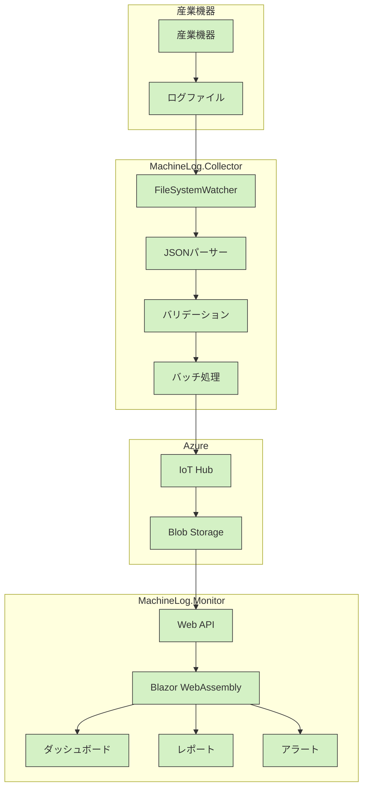
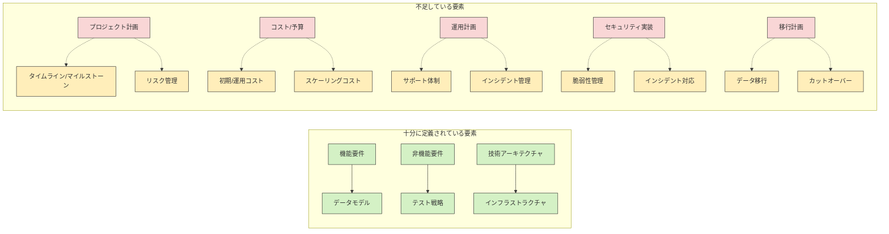

# 産業機器ログ収集・分析プラットフォーム システム仕様分析レポート

## 1. 概要

本レポートは、`.clinerules`ディレクトリに記載されたシステム仕様書の整合性と過不足を分析した結果をまとめたものです。産業機器ログ収集・分析プラットフォーム（MachineLog）の仕様について、各コンポーネント間の整合性と仕様全体の充足度を評価しています。

## 2. 分析対象ドキュメント

以下の仕様書を分析対象としました：

1. `00-project-overview.md` - プロジェクト概要
2. `01-architecture.md` - システムアーキテクチャ
3. `02-client-app.md` - MachineLog.Collector（クライアントアプリ）
4. `03-web-app.md` - MachineLog.Monitor（Webアプリ）
5. `04-common-library.md` - MachineLog.Common（共通ライブラリ）
6. `05-testing.md` - テスト戦略
7. `06-infrastructure.md` - インフラストラクチャ

## 3. 整合性分析

### 3.1 全体アーキテクチャの整合性

| 観点 | 評価 | 詳細 |
|------|------|------|
| コンポーネント構成 | ✅ 整合 | 4つの主要コンポーネント（MachineLog.Collector、MachineLog.Monitor、MachineLog.Common、MachineLog.Infrastructure）が各仕様書で一貫して定義されている |
| データフロー | ✅ 整合 | 産業機器 → Collector → IoT Hub → Blob Storage → Monitor → ユーザー というデータフローが一貫して定義されている |
| 技術スタック | ✅ 整合 | .NET 8.0、Azure IoT Hub、Blob Storage、Blazor WebAssembly、Terraformなど技術選択が一貫している |

### 3.2 非機能要件の整合性

| 要件 | 目標値 | 各ドキュメントでの整合性 | 評価 |
|------|--------|--------------------------|------|
| パフォーマンス | 1秒あたり10,000ログエントリ処理 | すべてのドキュメントで一貫した目標値 | ✅ 整合 |
| 可用性 | 99.99%以上（年間ダウンタイム52分以内） | 概要とインフラ仕様で一致 | ✅ 整合 |
| レイテンシ | ログ収集から保存まで5秒以内 | すべての関連ドキュメントで一貫 | ✅ 整合 |
| スケーラビリティ | 最大50,000台の機器まで対応可能 | 概要と各コンポーネント仕様で一致 | ✅ 整合 |
| セキュリティ | TLS 1.3暗号化、AES-256暗号化など | 全体とコンポーネント仕様で一致 | ✅ 整合 |

### 3.3 データモデルの整合性

| 観点 | 評価 | 詳細 |
|------|------|------|
| LogEntryモデル | ✅ 整合 | Collector仕様とCommonライブラリ仕様で一致（必須フィールド、長さ制限など） |
| バッチ処理仕様 | ✅ 整合 | バッチサイズ（最大1MB、10,000エントリ）がCollectorとCommon仕様で一致 |
| バリデーションルール | ✅ 整合 | CollectorとCommonライブラリで同じバリデーション基準が定義されている |

### 3.4 テスト戦略の整合性

| 観点 | 評価 | 詳細 |
|------|------|------|
| テストカバレッジ目標 | ✅ 整合 | 単体テストカバレッジ90%以上の目標が各ドキュメントで一致 |
| テスト種類 | ✅ 整合 | 単体テスト、統合テスト、パフォーマンステスト、E2Eテストなどの種類が一貫している |
| テストツール | ✅ 整合 | xUnit.net、BenchmarkDotNet、Playwrightなどのツール選択が一貫している |

### 3.5 デプロイメント戦略の整合性

| 観点 | 評価 | 詳細 |
|------|------|------|
| インフラストラクチャ定義 | ✅ 整合 | Terraformの使用が一貫して定義されている |
| CI/CD | ✅ 整合 | Azure DevOps Pipelinesによる自動化アプローチが一貫している |
| 環境分離 | ✅ 整合 | 開発/テスト/ステージング/本番環境の分離が一貫している |

## 4. 過不足分析

### 4.1 十分に定義されている要素

| カテゴリ | 詳細 |
|----------|------|
| 機能要件とデータモデル | • ログデータのフォーマットと処理フロー<br>• 必須フィールドと検証ルール<br>• ユーザーインターフェース機能（ダッシュボード、レポート等） |
| 非機能要件 | • パフォーマンス、可用性、スケーラビリティの具体的な数値目標<br>• セキュリティ要件<br>• 災害復旧（DR）戦略 |
| 技術アーキテクチャ | • コンポーネント設計と責任範囲<br>• データフローと処理ステップ<br>• インターフェース定義 |
| インフラストラクチャ | • Azureリソース構成の詳細<br>• ネットワーク設計<br>• スケーリング戦略<br>• セキュリティ設定 |
| テスト戦略 | • テスト種類とアプローチ<br>• テスト環境と責任分担<br>• テスト自動化戦略 |
| 開発標準 | • コーディング規約<br>• 命名規則<br>• ドキュメント標準 |

### 4.2 不足している要素

| カテゴリ | 不足している項目 | 重要度 |
|----------|------------------|--------|
| プロジェクト管理 | • 具体的なプロジェクトタイムライン<br>• フェーズ定義とマイルストーン<br>• 依存関係管理計画<br>• リスク管理計画（技術リスク、スケジュールリスク等） | 高 |
| リソース計画 | • 人的リソースの詳細配分<br>• ハードウェア/ソフトウェアの調達計画<br>• 外部リソース依存の管理計画 | 中 |
| 予算とコスト | • 詳細な初期構築コスト見積り<br>• 運用コスト見積り<br>• スケーリング時のコスト増加予測<br>• コスト管理と最適化の具体的プロセス | 高 |
| 移行計画 | • 既存システムがある場合の移行戦略<br>• データ移行計画<br>• 切り替え（カットオーバー）戦略<br>• ロールバック計画 | 中〜高 |
| 運用計画 | • サポート体制と責任分担<br>• インシデント管理プロセスの詳細<br>• 変更管理プロセス<br>• リリース管理プロセス<br>• キャパシティ管理の詳細プロセス | 高 |
| ユーザードキュメント | • エンドユーザーマニュアル計画<br>• 管理者ガイド計画<br>• トレーニング資料と実施計画 | 中 |
| 実装詳細 | • APIエンドポイントの詳細仕様<br>• データベーススキーマの詳細設計<br>• UI/UXの詳細デザインガイドライン<br>• 詳細なエラーコードとメッセージ定義 | 中 |
| セキュリティ実装 | • 詳細なセキュリティテスト計画<br>• インシデント対応計画<br>• 脆弱性管理プロセス | 高 |
| サンプル実装 | • サンプルコード<br>• プロトタイプ実装<br>• 参照実装<br>• 開発者用チュートリアル | 低〜中 |

## 5. 推奨事項

システム仕様の整合性は全体的に高く保たれていますが、以下の要素を追加することでさらに完全な仕様となります：

### 5.1 優先度高

1. **プロジェクト計画ドキュメント**
   ```
   07-project-plan.md
   ```
   - プロジェクトタイムライン
   - フェーズとマイルストーン
   - クリティカルパス
   - リスク管理計画

2. **コスト見積りと予算計画**
   ```
   08-cost-budget.md
   ```
   - 初期開発コスト
   - インフラストラクチャコスト
   - 運用コスト
   - スケーリングに伴うコスト増加予測

3. **運用計画**
   ```
   09-operations.md
   ```
   - 運用体制と責任分担
   - インシデント管理プロセス
   - SLAとサポートレベル
   - 監視とアラート対応プロセス
   - バックアップ/リストア手順

4. **セキュリティ詳細設計**
   ```
   10-security-details.md
   ```
   - セキュリティインシデント対応計画
   - 脆弱性管理プロセス
   - セキュリティモニタリングとアラート

### 5.2 優先度中

1. **移行計画**（既存システムがある場合）
   ```
   11-migration-plan.md
   ```
   - 現行システムからの移行戦略
   - データ移行方法
   - 切り替え計画
   - ロールバック計画

2. **APIとインターフェース詳細仕様**
   ```
   12-api-specifications.md
   ```
   - RESTful APIエンドポイント詳細
   - リクエスト/レスポンスフォーマット
   - エラーコードと対応
   - API認証と認可

3. **ユーザードキュメント計画**
   ```
   13-user-documentation.md
   ```
   - エンドユーザーマニュアル構成
   - 管理者ガイド構成
   - トレーニング資料計画

### 5.3 優先度低

1. **サンプル実装とデモ**
   ```
   14-sample-implementation.md
   ```
   - サンプルコード
   - 開発者向けチュートリアル
   - デモシナリオ

## 6. Mermaid図：システム構成とギャップ分析

### 6.1 システムアーキテクチャ全体図



### 6.2 仕様ギャップ分析



## 7. まとめと結論

本システム仕様は、技術アーキテクチャ、機能要件、非機能要件、テスト戦略において十分な詳細度と整合性を持っています。特に、各コンポーネント間のインターフェースとデータフローは明確に定義されており、技術的な実装の基盤として十分な情報が提供されています。

しかし、プロジェクト管理、コスト計画、運用計画、セキュリティ実装の詳細など、システム構築の成功に不可欠ないくつかの要素が不足しています。特に優先度の高い項目（プロジェクト計画、コスト見積り、運用計画、セキュリティ詳細設計）を早急に補完することで、プロジェクトの成功確率を高めることができます。

これらの追加要素を含めることで、技術的な実装だけでなく、プロジェクト全体の成功に必要な包括的な計画となります。整合性の高い現在の仕様をベースに、本レポートで指摘した不足要素を補完することを推奨します。