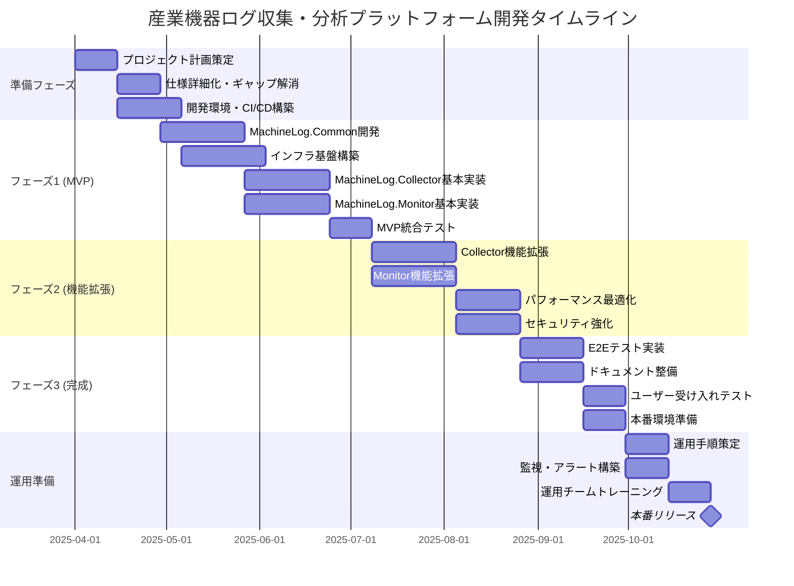
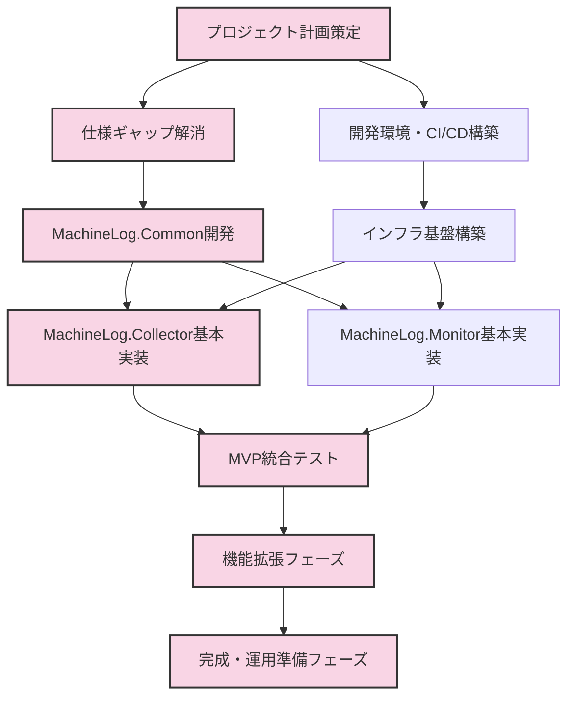

# 産業機器ログ収集・分析プラットフォーム 実装計画

## 1. 実行概要

本文書は、産業機器ログ収集・分析プラットフォーム（MachineLog）の実装計画を詳述しています。本計画は、すでに定義された仕様書と実施した仕様分析に基づいています。本プロジェクトは初期段階にあり、チームは編成済みですが開発はまだ開始されていません。

## 2. プロジェクト体制

プロジェクト概要で定義されているチーム構成:

| 役割 | 人数 | 主な責任 |
|------|------|----------|
| プロジェクトマネージャー | 1名 | プロジェクト全体の管理、ステークホルダーコミュニケーション |
| ソフトウェアアーキテクト | 1名 | 技術的意思決定、アーキテクチャ設計 |
| バックエンド開発者 | 3名 | MachineLog.Collector、MachineLog.Common、バックエンドAPI開発 |
| フロントエンド開発者 | 2名 | MachineLog.Monitor、Blazor WebAssemblyインターフェース開発 |
| DevOpsエンジニア | 1名 | CI/CD、インフラストラクチャ管理、Terraform構築 |
| QAエンジニア | 2名 | テスト計画、自動テスト実装、品質保証 |

## 3. フェーズとタイムライン

アジャイル開発（Scrum）手法を採用し、2週間のスプリントサイクルで開発を進めます。全体のタイムラインは以下の通りです。

## 4. 実装優先順位

以下の優先順位に基づいて実装を進めます:

### 4.1 第一優先事項（準備フェーズ）

1. **不足している仕様の補完**
   - プロジェクト計画ドキュメント作成
   - コスト見積りと予算計画の策定
   - 運用計画の策定
   - セキュリティ詳細設計の策定

2. **開発基盤の構築**
   - Azure開発環境のセットアップ
   - CI/CDパイプラインの構築（Azure DevOps）
   - コード品質管理ツールの導入（SonarQube）
   - コードリポジトリの構成とブランチ戦略の策定

3. **アーキテクチャ検証**
   - 技術的な検証（PoC）の実施
   - パフォーマンス要件の検証
   - スケーラビリティ設計の確認

### 4.2 第二優先事項（フェーズ1 - MVP）

1. **MachineLog.Common**
   - データモデルとバリデーションの実装
   - ユーティリティクラスの実装
   - 単体テストの実装（90%以上のカバレッジ）

2. **インフラストラクチャ基盤**
   - Terraformモジュールの開発
   - Azure IoT Hub設定
   - Blob Storageセットアップ
   - App Service環境準備

3. **MachineLog.Collector（基本機能）**
   - ファイル監視機能
   - JSON Lines解析機能
   - バッチ処理基本機能
   - IoT Hubへのアップロード機能

4. **MachineLog.Monitor（基本機能）**
   - Blazor WebAssemblyプロジェクト設定
   - 基本UI/UXフレームワーク
   - シンプルなログ表示機能
   - 認証基盤（Microsoft Entra ID）

### 4.3 第三優先事項（フェーズ2 - 機能拡張）

1. **MachineLog.Collector（拡張）**
   - 高度なバッチ処理
   - エラーハンドリングとリトライ
   - パフォーマンス最適化
   - 監視・テレメトリ機能

2. **MachineLog.Monitor（拡張）**
   - ダッシュボード機能
   - 高度なフィルタリング機能
   - レポート機能
   - アラート機能

3. **パフォーマンスとスケーラビリティ**
   - ロードテスト実施
   - パフォーマンスボトルネック特定
   - 自動スケーリング設定の最適化

4. **セキュリティ強化**
   - 脆弱性スキャン導入
   - ペネトレーションテスト実施
   - セキュリティ監査対応

### 4.4 第四優先事項（フェーズ3 - 完成とテスト）

1. **包括的テスト**
   - E2Eテスト自動化
   - カオスエンジニアリングテスト
   - 回帰テスト自動化

2. **ドキュメント作成**
   - ユーザーマニュアル
   - 管理者ガイド
   - API仕様書

3. **運用準備**
   - 監視・アラート設定
   - 運用手順書
   - リリース計画

## 5. スプリント計画（最初の3スプリント）

### スプリント1（2025/04/01 - 2025/04/14）

| チームメンバー | タスク |
|----------------|--------|
| プロジェクトマネージャー | • 詳細プロジェクト計画策定 • リスク管理計画作成 • コミュニケーション計画策定 |
| ソフトウェアアーキテクト | • アーキテクチャ詳細化 • 技術的制約の特定 • APIインターフェース設計 |
| バックエンド開発者 (3名) | • 開発環境セットアップ • MachineLog.Commonプロジェクト構造作成 • データモデル設計の詳細化 |
| フロントエンド開発者 (2名) | • フロントエンド開発環境セットアップ • UIコンポーネント設計 • デザインシステム基盤作成 |
| DevOpsエンジニア | • CI/CDパイプライン構築 • Terraformリポジトリ構築 • Azure環境初期セットアップ |
| QAエンジニア (2名) | • テスト計画策定 • テスト環境セットアップ • 自動テストフレームワーク選定 |

**成果物**:
- 詳細プロジェクト計画書
- アーキテクチャ詳細設計書
- CI/CD基盤
- 開発環境セットアップ完了
- テスト計画書

### スプリント2（2025/04/15 - 2025/04/28）

| チームメンバー | タスク |
|----------------|--------|
| プロジェクトマネージャー | • 運用計画の策定 • ステークホルダーとの進捗レビュー • リスク軽減策の実施 |
| ソフトウェアアーキテクト | • セキュリティ詳細設計 • パフォーマンス設計レビュー • 技術的PoC検証 |
| バックエンド開発者 (3名) | • MachineLog.Common基本クラス実装 • LogEntryとバリデーション実装 • ユーティリティクラス実装開始 |
| フロントエンド開発者 (2名) | • MachineLog.Monitorプロジェクト構築 • 認証機能の実装 • 基本UIコンポーネント実装 |
| DevOpsエンジニア | • Terraform IoT Hubモジュール開発 • Terraform Blob Storageモジュール開発 • 開発環境デプロイ自動化 |
| QAエンジニア (2名) | • 自動テストフレームワーク構築 • MachineLog.Common単体テスト作成 • テスト自動化パイプライン構築 |

**成果物**:
- セキュリティ詳細設計書
- 運用計画書
- MachineLog.Common基本実装
- MachineLog.Monitor基本構造
- Terraformコアモジュール
- テスト自動化フレームワーク

### スプリント3（2025/04/29 - 2025/05/12）

| チームメンバー | タスク |
|----------------|--------|
| プロジェクトマネージャー | • コスト見積り精緻化 • 次フェーズ詳細計画作成 • 障害対応計画策定 |
| ソフトウェアアーキテクト | • アーキテクチャレビュー実施 • パフォーマンス検証 • スケーラビリティ設計確認 |
| バックエンド開発者 (3名) | • MachineLog.Collector基本構造実装 • ファイル監視機能実装 • JSON Lines解析実装 |
| フロントエンド開発者 (2名) | • ログリスト表示UI実装 • 基本フィルタリング機能実装 • APIクライアント実装 |
| DevOpsエンジニア | • テスト環境完全自動化 • App Serviceモジュール開発 • 監視基盤構築開始 |
| QAエンジニア (2名) | • 統合テスト計画策定 • MachineLog.Common完全テスト実装 • パフォーマンステスト設計 |

**成果物**:
- MachineLog.Collector基本実装
- MachineLog.Monitor基本機能
- テスト環境の完全自動化
- 詳細コスト見積り書
- 統合テスト計画

## 6. 開発プラクティス

### 6.1 ブランチ戦略

GitHubフローに基づくブランチ戦略を採用:

- `main`: 常にデプロイ可能な状態を維持
- 機能ブランチ: `feature/{機能名}`
- バグ修正ブランチ: `bugfix/{バグID}`
- リリースブランチ: `release/{バージョン}`

### 6.2 コード品質管理

- コードレビュープロセス: 最低2名のレビュアーによるレビュー承認が必要
- 静的コード分析: SonarQubeを使用して自動実行
- コードスタイル: StyleCop.Analyzersと.editorconfig設定を適用

### 6.3 テスト戦略

- 単体テスト: 新規コードは必ず単体テストを作成（カバレッジ目標90%以上）
- 統合テスト: 主要コンポーネント間の相互作用を検証
- パフォーマンステスト: スプリント3以降で定期実行
- E2Eテスト: フェーズ2以降で自動化実装

### 6.4 リリース管理

- 継続的インテグレーション: すべてのコミットで自動テスト実行
- 継続的デリバリー: `main`ブランチへのマージで開発環境に自動デプロイ
- ステージング環境: 手動承認後にデプロイ
- 本番環境: リリース計画に基づき実施

## 7. リスクと対策

| リスク | 影響度 | 確率 | 対策 |
|--------|--------|------|------|
| パフォーマンス要件の達成が困難 | 高 | 中 | • 早期からのパフォーマンステスト実施 • ボトルネック特定のためのプロファイリング • スケーリング戦略の見直し |
| クラウドリソースコストの増大 | 中 | 中 | • 定期的なコスト監視 • リソースの適正サイジング • 自動スケーリングの適切な閾値設定 |
| セキュリティ脆弱性の発見 | 高 | 低 | • 定期的な脆弱性スキャン • セキュアコーディングプラクティスの徹底 • 迅速なパッチ適用プロセスの確立 |
| チームメンバーの離脱 | 中 | 低 | • 知識共有セッションの定期開催 • 詳細なドキュメント作成 • ペアプログラミングの実施 |
| 要件の変更・追加 | 高 | 中 | • 変更管理プロセスの確立 • バッファを含むスケジュール策定 • 優先順位付けの徹底 |

## 8. 依存関係とクリティカルパス

プロジェクト成功のためのクリティカルパス:

1. MachineLog.Common完成 → MachineLog.Collector/Monitor開発
2. インフラストラクチャ基盤構築 → コンポーネントデプロイ
3. IoT Hub設定 → Collector統合テスト
4. Azure AD (Entra ID)統合 → Monitor認証機能

## 9. 次のステップ

1. 本計画書のレビューと承認
2. 不足している仕様書の作成開始（プロジェクト計画、コスト見積り、運用計画、セキュリティ詳細）
3. 開発環境とCI/CDパイプラインの構築
4. スプリント1キックオフミーティングの準備

本計画は、プロジェクトの進行状況に応じて定期的に見直しと更新を行います。特に各スプリントの振り返り（レトロスペクティブ）で得られた知見を反映させ、継続的に改善していきます。