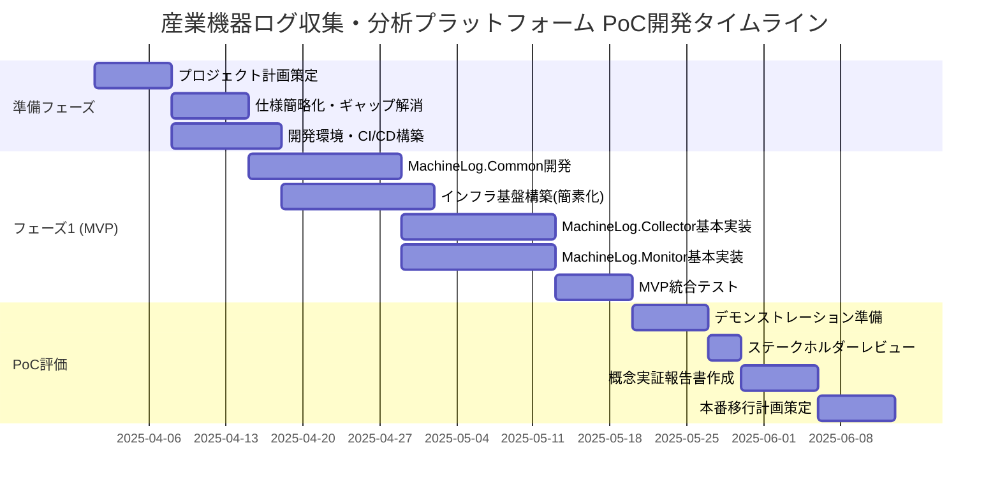

# 産業機器ログ収集・分析プラットフォーム 実装計画

## 1. 実行概要

本文書は、産業機器ログ収集・分析プラットフォーム（MachineLog）の実装計画を詳述しています。本計画は、すでに定義された仕様書と実施した仕様分析に基づいています。本プロジェクトは初期段階にあり、チームは編成済みですが開発はまだ開始されていません。

## 2. プロジェクト体制

プロジェクト概要で定義されているチーム構成:

| 役割 | 人数 | 主な責任 |
|------|------|----------|
| プロジェクトマネージャー | 1名 | プロジェクト全体の管理、ステークホルダーコミュニケーション |
| ソフトウェアアーキテクト | 1名 | 技術的意思決定、アーキテクチャ設計 |
| バックエンド開発者 | 3名 | MachineLog.Collector、MachineLog.Common、バックエンドAPI開発 |
| フロントエンド開発者 | 2名 | MachineLog.Monitor、Blazor WebAssemblyインターフェース開発 |
| DevOpsエンジニア | 1名 | CI/CD、インフラストラクチャ管理、Terraform構築 |
| QAエンジニア | 2名 | テスト計画、自動テスト実装、品質保証 |

## 3. フェーズとタイムライン

PoCの段階では、最小限のリソースでコアコンセプトを実証することに集中します：

## 4. 実装優先順位

以下の優先順位に基づいて実装を進めます:

### 4.1 第一優先事項（準備フェーズ）

1. **不足している仕様の補完**
   - プロジェクト計画ドキュメント作成
   - コスト見積りと予算計画の策定
   - 運用計画の策定
   - セキュリティ詳細設計の策定

2. **開発基盤の構築**
   - Azure開発環境のセットアップ
   - CI/CDパイプラインの構築（Azure DevOps）
   - コード品質管理ツールの導入（SonarQube）
   - コードリポジトリの構成とブランチ戦略の策定

3. **アーキテクチャ検証**
   - 技術的な検証（PoC）の実施
   - パフォーマンス要件の検証
   - スケーラビリティ設計の確認

### 4.2 第二優先事項（フェーズ1 - MVP）

1. **MachineLog.Common**
   - データモデルとバリデーションの実装
   - ユーティリティクラスの実装
   - 単体テストの実装（90%以上のカバレッジ）

2. **インフラストラクチャ基盤**
   - Terraformモジュールの開発
   - Azure IoT Hub設定
   - Blob Storageセットアップ
   - App Service環境準備

3. **MachineLog.Collector（基本機能）**
   - ファイル監視機能
   - JSON Lines解析機能
   - バッチ処理基本機能
   - IoT Hubへのアップロード機能

4. **MachineLog.Monitor（基本機能）**
   - Blazor WebAssemblyプロジェクト設定
   - 基本UI/UXフレームワーク
   - シンプルなログ表示機能
   - 認証基盤（Microsoft Entra ID）

### 4.3 第三優先事項（フェーズ2 - 機能拡張）

1. **MachineLog.Collector（拡張）**
   - 高度なバッチ処理
   - エラーハンドリングとリトライ
   - パフォーマンス最適化
   - 監視・テレメトリ機能

2. **MachineLog.Monitor（拡張）**
   - ダッシュボード機能
   - 高度なフィルタリング機能
   - レポート機能
   - アラート機能

3. **パフォーマンスとスケーラビリティ**
   - ロードテスト実施
   - パフォーマンスボトルネック特定
   - 自動スケーリング設定の最適化

4. **セキュリティ強化**
   - 脆弱性スキャン導入
   - ペネトレーションテスト実施
   - セキュリティ監査対応

### 4.4 第四優先事項（フェーズ3 - 完成とテスト）

1. **包括的テスト**
   - E2Eテスト自動化
   - カオスエンジニアリングテスト
   - 回帰テスト自動化

2. **ドキュメント作成**
   - ユーザーマニュアル
   - 管理者ガイド
   - API仕様書

3. **運用準備**
   - 監視・アラート設定
   - 運用手順書
   - リリース計画

## 5. スプリント計画（最初のスプリント - PoC向け）

### スプリント1（2025/04/01 - 2025/04/14）

| チームメンバー | タスク |
|----------------|--------|
| プロジェクトマネージャー | • 簡略化されたPoC計画策定 • コスト管理計画作成 • ステークホルダー期待値整理 |
| ソフトウェアアーキテクト | • 低コスト指向アーキテクチャ設計 • 技術的制約の特定 • 簡略化されたAPIインターフェース設計 |
| バックエンド開発者 (2名) | • 開発環境セットアップ • MachineLog.Commonプロジェクト構造作成 • 最小データモデル実装 |
| フロントエンド開発者 (1名) | • フロントエンド開発環境セットアップ • 最小UIコンポーネント設計 • モックインターフェース作成 |
| DevOpsエンジニア | • 簡素化されたCI/CD構築 • 低コストTerraformモジュール開発 • 開発環境構築 |
| QAエンジニア (1名) | • テスト計画簡略化 • 最小テストケース作成 • 手動テスト計画策定 |

**成果物**:
- PoCプロジェクト計画書
- 低コスト指向アーキテクチャ設計書
- 開発環境
- コスト追跡システム

## 6. 開発プラクティス

### 6.1 ブランチ戦略

GitHubフローに基づくブランチ戦略を採用:

- `main`: 常にデプロイ可能な状態を維持
- 機能ブランチ: `feature/{機能名}`
- バグ修正ブランチ: `bugfix/{バグID}`
- リリースブランチ: `release/{バージョン}`

### 6.2 コード品質管理

- コードレビュープロセス: 最低2名のレビュアーによるレビュー承認が必要
- 静的コード分析: SonarQubeを使用して自動実行
- コードスタイル: StyleCop.Analyzersと.editorconfig設定を適用

### 6.3 テスト戦略

- 単体テスト: 新規コードは必ず単体テストを作成（カバレッジ目標90%以上）
- 統合テスト: 主要コンポーネント間の相互作用を検証
- パフォーマンステスト: スプリント3以降で定期実行
- E2Eテスト: フェーズ2以降で自動化実装

### 6.4 リリース管理

- 継続的インテグレーション: すべてのコミットで自動テスト実行
- 継続的デリバリー: `main`ブランチへのマージで開発環境に自動デプロイ
- ステージング環境: 手動承認後にデプロイ
- 本番環境: リリース計画に基づき実施

## 7. リスクと対策

| リスク | 影響度 | 確率 | 対策 |
|--------|--------|------|------|
| 実際の負荷に対するパフォーマンス評価不足 | 中 | 高 | • PoCステージでも代表的な負荷パターンをシミュレート • スケールアップパスを事前計画 • 本番環境への移行計画に余裕を持たせる |
| PoC環境でのリソース制限による機能制約 | 中 | 高 | • コア機能に集中 • 非機能要件の優先順位付け • ステークホルダーとの期待値調整 |
| 低コスト構成から本番移行時の構成変更複雑化 | 高 | 中 | • インフラ構成を抽象化 • Terraformモジュールの段階的拡張設計 • データ移行戦略の早期策定 |
| セキュリティ簡略化によるリスク | 高 | 中 | • 機密データを使用しない • 基本的なセキュリティプラクティスは維持 • ネットワークレベルでアクセス制限 |

## 8. 依存関係とクリティカルパス

プロジェクト成功のためのクリティカルパス:

1. MachineLog.Common完成 → MachineLog.Collector/Monitor開発
2. インフラストラクチャ基盤構築 → コンポーネントデプロイ
3. IoT Hub設定 → Collector統合テスト
4. Azure AD (Entra ID)統合 → Monitor認証機能

## 9. 次のステップ

1. 本計画書のレビューと承認
2. 不足している仕様書の作成開始（プロジェクト計画、コスト見積り、運用計画、セキュリティ詳細）
3. 開発環境とCI/CDパイプラインの構築
4. スプリント1キックオフミーティングの準備

本計画は、プロジェクトの進行状況に応じて定期的に見直しと更新を行います。特に各スプリントの振り返り（レトロスペクティブ）で得られた知見を反映させ、継続的に改善していきます。