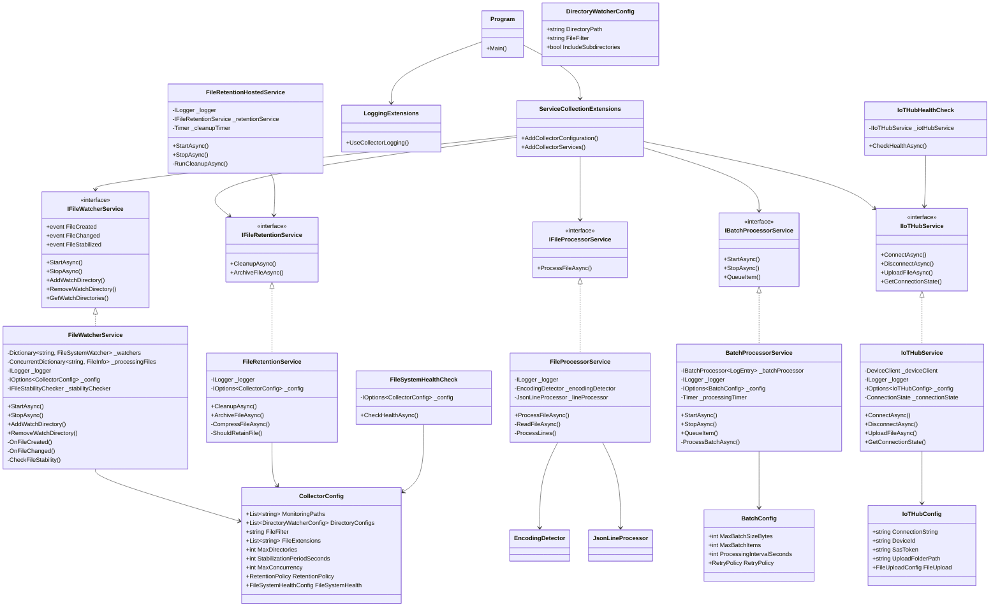

# MachineLog.Collector

MachineLog.Collectorは、機械のログファイルを監視、収集し、Azure IoT Hubに送信するためのサービスです。製造業やインフラストラクチャなどの分野で、分散環境にある機器やシステムからのログデータを効率的に収集・転送するために設計されています。

## 概要

MachineLog.Collectorは以下の主要機能を提供します：

- **ファイル監視**: 設定された複数のディレクトリを監視し、新規または変更されたログファイルを検出
- **安定性検証**: ファイルが完全に書き込まれたことを確認するための安定性チェック
- **自動エンコーディング検出**: 様々なエンコーディングで書かれたログファイルの自動検出と処理
- **JSONLファイル処理**: 構造化ログデータの解析と処理
- **バッチ処理**: 効率的なリソース利用のためのログエントリのバッチ処理
- **IoT Hub連携**: 処理済みデータのAzure IoT Hubへの安全な転送
- **ファイル保持ポリシー**: 処理済みファイルの保持と自動アーカイブ・クリーンアップ
- **ヘルスモニタリング**: サービスの健全性を監視するためのエンドポイント提供

## ディレクトリ構成

```
MachineLog.Collector/
├── Extensions/         - 拡張メソッド（DIコンテナ設定、ログ設定など）
├── Health/             - ヘルスチェック実装
├── Models/             - 設定用モデルクラス
├── Services/           - サービス実装
│   ├── ファイル監視    - FileWatcherService, FileStabilityChecker
│   ├── ファイル処理    - FileProcessorService, EncodingDetector, JsonLineProcessor
│   ├── IoT Hub連携     - IoTHubService
│   ├── バッチ処理      - BatchProcessorService
│   └── ファイル保持    - FileRetentionService, FileRetentionHostedService
├── Utilities/          - エラーハンドリングなどのユーティリティ
├── Program.cs          - アプリケーションのエントリポイント
└── appsettings.json    - アプリケーション設定
```

## 実行の前提条件

- .NET 6.0以上
- Azure IoT Hubアカウント（ファイルアップロード機能が有効）
- 適切な権限を持つIoT Hubデバイス登録
- 監視対象ディレクトリへのアクセス権
- オプション: Azure Key Vaultアクセス（機密設定のため）
- オプション: Application Insightsアカウント（テレメトリのため）

## 構成

アプリケーションは`appsettings.json`ファイルまたは環境変数から設定できます。主な設定項目：

### CollectorConfig

```json
"CollectorConfig": {
  "MonitoringPaths": [],  // 監視するディレクトリパスのリスト
  "FileFilter": "*.jsonl", // 監視対象ファイルのフィルター
  "StabilizationPeriodSeconds": 5, // ファイル安定化待機時間
  "MaxConcurrency": 4, // 最大並行処理数
  "RetentionPolicy": {
    "RetentionDays": 7, // 通常ファイルの保持期間（日）
    "LargeFileRetentionDays": 30, // 大きいファイルの保持期間（日）
    "LargeFileSizeThreshold": 52428800, // 「大きいファイル」の閾値（バイト）
    "ArchiveDirectoryPath": "archive", // アーカイブディレクトリ
    "CompressProcessedFiles": true // 処理済みファイルを圧縮するか
  }
}
```

### BatchConfig

```json
"BatchConfig": {
  "MaxBatchSizeBytes": 1048576, // 最大バッチサイズ（バイト）
  "MaxBatchItems": 10000, // バッチあたりの最大アイテム数
  "ProcessingIntervalSeconds": 30, // バッチ処理間隔
  "RetryPolicy": {
    "MaxRetries": 5, // 最大リトライ回数
    "InitialRetryIntervalSeconds": 1, // 初期リトライ間隔
    "MaxRetryIntervalSeconds": 30, // 最大リトライ間隔
    "RetryBackoffMultiplier": 2.0 // バックオフ乗数
  }
}
```

### IoTHubConfig

```json
"IoTHubConfig": {
  "ConnectionString": "", // IoT Hubの接続文字列
  "DeviceId": "", // デバイスID
  "SasToken": null, // SASトークン（オプション）
  "UploadFolderPath": "logs", // アップロード先フォルダパス
  "FileUpload": {
    "SasTokenTimeToLiveMinutes": 60, // SASトークンの有効期間
    "EnableNotification": true, // アップロード通知の有効化
    "LockDurationMinutes": 1, // ロック期間
    "DefaultTimeToLiveDays": 1, // TTL期間
    "MaxDeliveryCount": 10 // 最大配信試行回数
  }
}
```

## 実行方法

### 開発環境での実行

```bash
cd MachineLog/src/MachineLog.Collector
dotnet run
```

### 本番環境での実行

```bash
cd MachineLog/src/MachineLog.Collector
dotnet publish -c Release -o out
cd out
dotnet MachineLog.Collector.dll
```

### クライアントアプリケーションの直接起動

#### Windows

```powershell
# リリースビルド後の実行
cd MachineLog/src/MachineLog.Collector/bin/Release/net6.0
.\MachineLog.Collector.exe

# または設定ファイルを指定して実行
.\MachineLog.Collector.exe --configuration appsettings.production.json

# バックグラウンドサービスとして登録
sc create MachineLogCollector binPath="C:\path\to\MachineLog.Collector.exe"
sc start MachineLogCollector

# サービスの停止
sc stop MachineLogCollector
```

#### Linux

```bash
# リリースビルド後の実行
cd MachineLog/src/MachineLog.Collector/bin/Release/net6.0
./MachineLog.Collector

# 環境変数を設定して実行
export IoTHubConfig__ConnectionString="your-connection-string"
./MachineLog.Collector

# systemdサービスとして登録 (/etc/systemd/system/machinelog-collector.service)
# [Unit]
# Description=MachineLog Collector Service
# 
# [Service]
# WorkingDirectory=/opt/machinelog/collector
# ExecStart=/opt/machinelog/collector/MachineLog.Collector
# Restart=always
# RestartSec=10
# SyslogIdentifier=machinelog-collector
# User=machinelog
# Environment=ASPNETCORE_ENVIRONMENT=Production
# 
# [Install]
# WantedBy=multi-user.target

# サービスの開始
sudo systemctl enable machinelog-collector
sudo systemctl start machinelog-collector

# サービスの状態確認
sudo systemctl status machinelog-collector
```

#### macOS

```bash
# リリースビルド後の実行
cd MachineLog/src/MachineLog.Collector/bin/Release/net6.0
./MachineLog.Collector

# launchdサービスとして登録 (~/Library/LaunchAgents/com.yourcompany.machinelog-collector.plist)
# <?xml version="1.0" encoding="UTF-8"?>
# <!DOCTYPE plist PUBLIC "-//Apple//DTD PLIST 1.0//EN" "http://www.apple.com/DTDs/PropertyList-1.0.dtd">
# <plist version="1.0">
# <dict>
#   <key>Label</key>
#   <string>com.yourcompany.machinelog-collector</string>
#   <key>ProgramArguments</key>
#   <array>
#     <string>/path/to/MachineLog.Collector</string>
#   </array>
#   <key>RunAtLoad</key>
#   <true/>
#   <key>KeepAlive</key>
#   <true/>
#   <key>StandardErrorPath</key>
#   <string>/tmp/machinelog-collector.err</string>
#   <key>StandardOutPath</key>
#   <string>/tmp/machinelog-collector.out</string>
# </dict>
# </plist>

# サービスの登録と開始
launchctl load ~/Library/LaunchAgents/com.yourcompany.machinelog-collector.plist

# サービスの停止
launchctl unload ~/Library/LaunchAgents/com.yourcompany.machinelog-collector.plist
```

### コマンドラインオプション

```
-c, --configuration <FILE>    設定ファイルのパスを指定
-e, --environment <NAME>      環境名を指定 (Development/Staging/Production)
-d, --directory <PATH>        監視対象ディレクトリを追加 (複数指定可)
-v, --verbose                 詳細なログ出力を有効化
-q, --quiet                   ログ出力を最小限に抑制
-h, --help                    ヘルプを表示
```

### Docker での実行

```bash
# Dockerfileのビルド
docker build -t machinelog-collector .

# コンテナ実行
docker run -d \
  -v /path/to/logs:/app/logs \
  -e IoTHubConfig__ConnectionString="your-connection-string" \
  -e CollectorConfig__MonitoringPaths__0="/app/logs" \
  --name machinelog-collector \
  machinelog-collector
```

## テスト方法

プロジェクトには単体テスト、統合テスト、パフォーマンステストが含まれています：

### 単体テスト実行

```bash
cd MachineLog/tests/MachineLog.Collector.Tests
dotnet test
```

### 統合テスト実行

```bash
cd MachineLog/tests/MachineLog.IntegrationTests
dotnet test
```

### パフォーマンステスト実行

```bash
cd MachineLog/tests/MachineLog.PerformanceTests
dotnet test
```

## クラス図

以下はMachineLog.Collectorの主要クラスと関係を示したクラス図です：



## ヘルスチェック

アプリケーションは以下のヘルスチェックエンドポイントを提供します：

- `GET /health`: シンプルなヘルスステータス
- `GET /health/detail`: 詳細なヘルスステータス（IoT Hub接続、ファイルシステム状態など）

## ロギングとモニタリング

- 構造化ログを使用（Serilog）
- Application Insightsとの統合（オプション）
- カスタムテレメトリとメトリクス

## エラーハンドリングとリトライポリシー

サービスには堅牢なエラーハンドリングと指数バックオフリトライポリシーが組み込まれており、ネットワーク障害やIoT Hub一時的障害から自動回復します。
